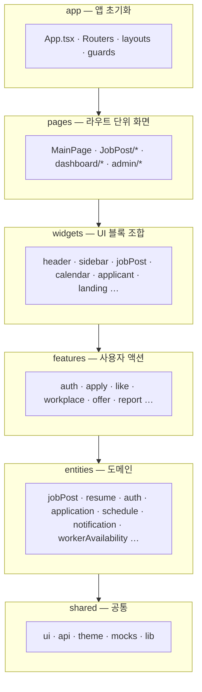
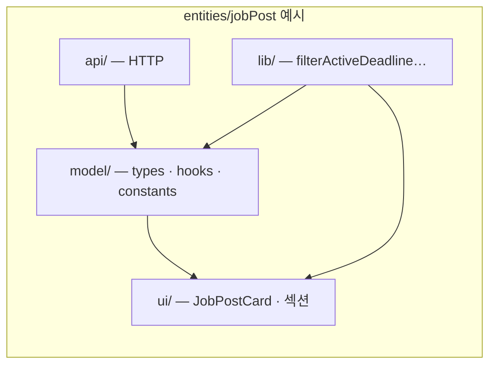
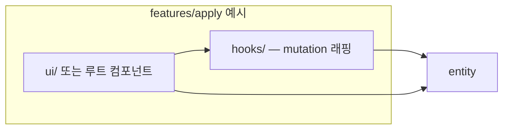
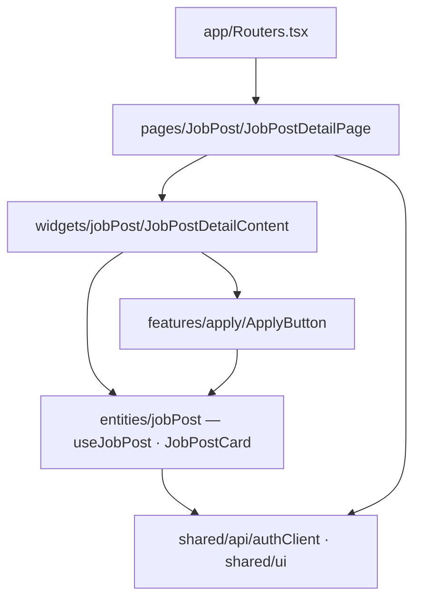
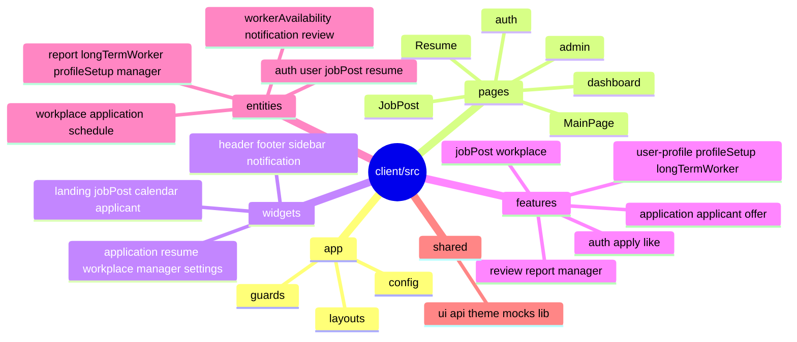
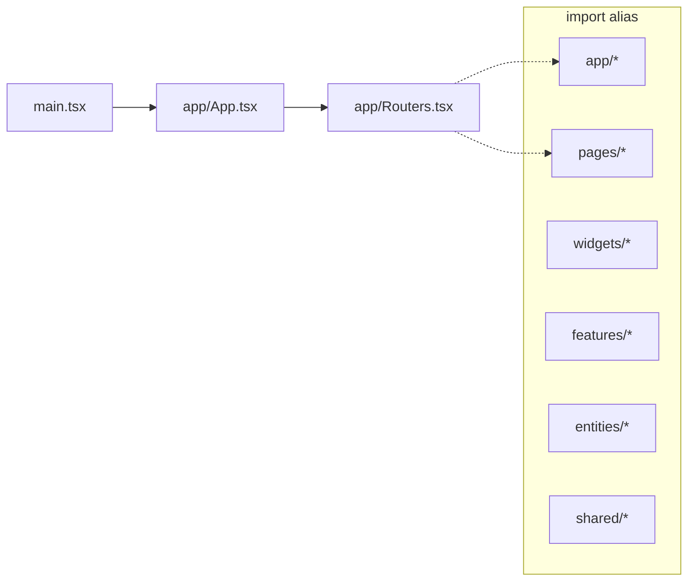

# 잇다 (ITDA) — 클라이언트

일용직·단기 구인구직 플랫폼 **잇다**의 React 프론트엔드입니다.  
구직자(Applicant), 고용주(Employer), 관리자(Manager) 역할에 맞는 화면과 대시보드를 제공합니다.

> 모노레포 루트 소개·배포 URL: [../README.md](../README.md)

---

## 기술 스택

| 분류 | 기술 |
|------|------|
| Framework | React 19.2, TypeScript ~6.0 |
| Build | Vite 8 |
| Styling | styled-components 6 |
| 클라이언트 상태 | Zustand 5 |
| 서버 상태 | TanStack Query 5 (`@tanstack/react-query`, 개발 시 Devtools) |
| HTTP | Axios 1 (`httpClient` / `authClient`), `qs` (쿼리 직렬화) |
| 라우팅 | React Router DOM 7 (`BrowserRouter`) |
| 폼 | React Hook Form 7 |
| DnD | @dnd-kit (core, sortable) |
| UI 보조 | Radix Progress, `polished` |
| 아이콘 | Lucide React |
| 토스트 | react-hot-toast |
| 무한 스크롤 | react-intersection-observer |
| 주소 검색 | react-daum-postcode |
| Mock (개발) | MSW 2 |
| 테스트 | Vitest 3, Testing Library, jsdom |
| Lint | ESLint 9 + typescript-eslint |

---

## 프로젝트 구조 (Feature-Sliced Design)

레이어 의존 방향: `app` → `pages` → `widgets` → `features` → `entities` → `shared`

```
src/
├── app/
│   ├── App.tsx                 # QueryClient, 테마, 인증 초기화, SSE
│   ├── AppThemeProvider.tsx
│   ├── Routers.tsx
│   ├── queryClient.ts
│   ├── config/routeHandle.ts   # 레이아웃별 UI 플래그 (예: 푸터 숨김 경로)
│   ├── guards/ManagerGuard.tsx
│   └── layouts/
│       ├── MainLayout.tsx      # 헤더 + 콘텐츠 + 푸터
│       ├── AuthLayout.tsx
│       ├── DashboardLayout.tsx # 헤더 + 사이드바 + 콘텐츠
│       └── ManagerLayout.tsx
│
├── pages/
│   ├── MainPage.tsx            # 랜딩 + 추천 공고
│   ├── auth/                   # 로그인, 회원가입
│   ├── JobPost/                # 공고 목록·상세·작성·수정
│   ├── Resume/                 # 이력서 목록·상세·작성
│   ├── Applicant/              # 지원자 관련 (목록 등)
│   ├── dashboard/              # 역할별·공통 대시보드 페이지
│   ├── admin/                  # 관리자 (매니저)
│   └── Test/
│
├── widgets/
│   ├── header/                 # 글로벌 헤더, 알림 드롭다운
│   ├── footer/
│   ├── sidebar/                # DashboardSidebar (접기/펼치기)
│   ├── manager/                # ManagerSidebar, 지표 카드
│   ├── landing/                # 메인 랜딩 (핵심 기능·쇼케이스)
│   ├── jobPost/                # 필터, 무한 목록, 상세, 작성·수정 폼
│   ├── resume/
│   ├── workplace/
│   ├── calendar/               # 고용주·구직자 캘린더, 주간 시간표·가용 시간표
│   ├── application/            # 지원·제안 상태별 목록
│   ├── applicant/              # 공고별 지원자 목록·일괄 제안 진입
│   ├── notification/
│   └── settings/
│
├── features/
│   ├── auth/                   # 로그인·회원가입, 세션 복구
│   ├── jobPost/                # 공고 CRUD, 템플릿, 마감·소유자 액션
│   ├── workplace/              # 사업장 CRUD
│   ├── apply/                  # 지원하기
│   ├── application/            # 제안 수락·거절, 구직자 액션 메뉴
│   ├── applicant/              # 지원자 승인·거절·채용 확정·완료
│   ├── offer/                  # 일괄 고용 제안, 자동 제안 대상, 이력서·공고 제안
│   ├── like/                   # 공고·이력서 좋아요
│   ├── review/                 # 근무 후 리뷰
│   ├── report/                 # 유저 신고 (모달·컨텍스트 메뉴)
│   ├── manager/                # 회원 정지, 신고 상태 처리
│   ├── user-profile/           # 프로필·비밀번호·이미지
│   ├── profileSetup/           # 사업장 필수 등록 유도 등 온보딩
│   ├── longTermWorker/         # 장기 근로자 토글
│   ├── search-address/         # 다음 우편번호
│   ├── control-Image/          # 이미지 업로드 UI
│   └── notification/           # SSE 연동 토스트
│
├── entities/
│   ├── auth/                   # JWT, refresh, 역할(EMPLOYER|APPLICANT|MANAGER)
│   ├── user/
│   ├── jobPost/                # 공고 API, 카드, 템플릿, 일괄 제안
│   ├── resume/
│   ├── workplace/
│   ├── application/
│   ├── schedule/               # 캘린더 일정
│   ├── workerAvailability/     # 구직자 주간 가용 시간
│   ├── notification/           # 알림 API, SSE 훅
│   ├── review/
│   ├── report/                 # 신고 API·타입
│   ├── longTermWorker/
│   ├── profileSetup/           # 프로필·사업장 세팅 상태
│   └── manager/                # 관리자 API·지표
│
└── shared/
    ├── api/                    # httpClient, authClient, CursorResponse
    ├── config/env.ts           # USE_MOCK 등
    ├── ui/                     # Button, Badge, Modal, Loading, NaverMap, ResizedImage …
    ├── lib/                    # D-Day, FormData, S3 URL 등
    ├── theme/
    ├── styles/
    ├── mocks/                  # MSW worker, handlers, JSON fixtures
    └── assets/
```

### FSD 다이어그램

> GitHub에서 Mermaid 미리보기가 안 되면 [Mermaid Live Editor](https://mermaid.live)에 붙여 넣어 확인할 수 있습니다.

#### 레이어 스택 (의존 방향)

상위 레이어만 하위를 import합니다. **역방향 import는 금지**입니다.



#### 슬라이스 내부 세그먼트





#### 요청 흐름 (공고 상세 예)



#### 레이어별 슬라이스 맵



#### 진입점 · Path alias



#### import 규칙 요약

| | |
|---|---|
| ✅ 허용 | `pages` → `widgets` → `features` → `entities` → `shared` |
| ✅ 권장 | 같은 레이어 슬라이스 간 직접 import는 최소화 (상위 레이어에서 조합) |
| ❌ 금지 | `entities` → `features`, `shared` → `entities` |

### Path alias (`vite.config.ts` / `tsconfig`)

`app`, `pages`, `widgets`, `features`, `entities`, `shared` — import 시 레이어 이름으로 참조합니다.

---

## 주요 기능

### 공통
- JWT 인증 (Access Token + Refresh Cookie, `useAuthInit` 세션 복구)
- 역할: `EMPLOYER` | `APPLICANT` | `MANAGER`
- 헤더 알림 (SSE 실시간 구독 + 목록)
- 반응형 UI (모바일 / 태블릿 / 데스크톱)
- `MainLayout` 푸터 — 무한 스크롤 페이지(`/jobposts`)에서는 숨김 (`routeHandle.ts`)

### 구직자 (Applicant)
- 공고 검색·필터·무한 스크롤 목록, 추천순(`RECOMMENDED`) 정렬
- 메인 추천 공고, 공고 상세·지원·좋아요
- 이력서 작성·관리, 지원·제안 내역
- 주간 가용 시간 등록·수정(매칭·추천 시그널에 활용)
- 근무 일정 캘린더(월간/주간), 리뷰 작성

### 고용주 (Employer)
- 사업장 등록·수정(multipart), 네이버 지도·주소 검색
- 공고 작성·수정·삭제·마감, 템플릿 저장/불러오기, 자동 제안 조건 입력
- 지원자 관리(승인/거절/채용 확정·완료), **일괄 고용 제안(Bulk offer)**
- 인재풀·이력서 기반 제안, 캘린더 일정, 대시보드 공고 요약

### 관리자 (Manager)
- `/admin` — `ManagerGuard` + 전용 사이드바
- 회원 검색·상세·정지/해제
- 신고 목록·상세·상태 변경
- 추천 지표 대시보드 (요약·일별 메트릭)

### 외부 연동
- 네이버 지도 API (`VITE_NAVER_MAP_CLIENT_ID`)
- 다음 우편번호 (`react-daum-postcode`)
- S3 이미지 URL (`shared/lib/s3ImageUrl`, `ResizedImage`)

---

## 라우팅

| 경로 | 설명 | 레이아웃 |
|------|------|----------|
| `/` | 메인 (랜딩 + 추천 공고) | Main |
| `/login`, `/signup` | 인증 | Auth |
| `/jobposts` | 공고 목록 (무한 스크롤, 푸터 없음) | Main |
| `/jobpost/:id` | 공고 상세 | Main |
| `/jobpost/create` | 공고 작성 | Main |
| `/jobpost/:id/edit` | 공고 수정 | Main |
| `/resumes` | 이력서 목록 | Main |
| `/resume/:id` | 이력서 상세 | Main |
| `/resume/edit` | 이력서 작성·수정 | Main |
| `/applicants` | 지원자 목록 | Main |
| `/dashboard` | 대시보드 홈 | Dashboard |
| `/dashboard/workplace` | 사업장 관리 | Dashboard |
| `/dashboard/talent` | 인재풀 | Dashboard |
| `/dashboard/calendar` | 일정 | Dashboard |
| `/dashboard/resume` | 이력서 관리 | Dashboard |
| `/dashboard/resume/edit` | 이력서 편집 | Dashboard |
| `/dashboard/applications` | 지원·제안 내역 | Dashboard |
| `/dashboard/settings` | 설정 | Dashboard |
| `/dashboard/notifications` | 알림 | Dashboard |
| `/admin` | 관리자 대시보드 | Manager |
| `/admin/users`, `/admin/users/:id` | 회원 관리 | Manager |
| `/admin/reports`, `/admin/reports/:id` | 신고 관리 | Manager |
| `/test` | 개발용 테스트 페이지 | 없음 |

로그인 시 역할에 따라 리다이렉트: `MANAGER` → `/admin`, 그 외 역할별 대시보드/메인.

---

## 시작하기

### 사전 요구사항

- Node.js 18+
- npm 9+

### 설치

```bash
cd client
npm install
```

### 환경 변수

`client` 디렉터리에 `.env` 또는 `.env.local`을 생성합니다.

```env
# API (프로덕션·직접 호출)
VITE_API_BASE_URL=http://localhost:8080

# 개발 서버 프록시 대상 (vite server.proxy → /api)
VITE_PROXY_TARGET=http://localhost:8080

VITE_TIMEOUT=30000

# 개발 시 MSW + mock 데이터 병합 (USE_MOCK, DEV에서만 worker 기동)
VITE_USE_MSW=false
VITE_USE_MOCK=false

# 네이버 지도
VITE_NAVER_MAP_CLIENT_ID=
```

| 변수 | 설명 |
|------|------|
| `VITE_API_BASE_URL` | Axios `baseURL` (배포·직접 API 호출) |
| `VITE_PROXY_TARGET` | `npm run dev` 시 `/api` 프록시 대상 |
| `VITE_TIMEOUT` | 요청 타임아웃(ms), 기본 30000 |
| `VITE_USE_MSW` | `true`이면 개발 모드에서 MSW worker 시작 |
| `VITE_USE_MOCK` | `true`이면 일부 목록 API에 mock JSON 병합 |
| `VITE_NAVER_MAP_CLIENT_ID` | 네이버 지도 클라이언트 ID |

### 스크립트

```bash
npm run dev       # 개발 서버 (기본 http://localhost:5173)
npm run build     # tsc + vite build → dist/
npm run preview   # 빌드 결과 미리보기
npm run lint      # ESLint
npm run test      # Vitest (1회)
npm run test:watch
```

---

## API·상태 관리

| 용도 | 클라이언트 | 비고 |
|------|------------|------|
| 공개 API (비로그인 목록 등) | `httpClient` | 인터셉터 없음 |
| 인증 API | `authClient` | Bearer 자동 첨부, 401 시 refresh |
| 서버 상태 | React Query | `queryKey` 도메인별 분리 |
| 클라이언트 UI 상태 | Zustand | `authStore`, `userProfileStore`, `notificationStore`, `workplaceStore`, `scheduleStore` |
| 실시간 알림 | SSE | `useNotificationSSE` (`App.tsx`) |

공고 목록은 커서 기반(`CursorResponse`: `contents`, `nextCursor`, `hasNext`).  
클라이언트에서 마감일 지난 공고는 `filterActiveDeadlineJobPosts`로 추가 필터링합니다.

---

## 디자인 시스템

토큰 정의: `src/shared/theme/theme.ts`

| 토큰 | 값 | 용도 |
|------|-----|------|
| `primary` | `#4DB190` | 브랜드, 주요 액션 |
| `secondary` | `#E2F1EC` | 보조 배경 |
| `tertiary` | `#02542D` | 강조 텍스트 |
| `highlight` | `#00C8B3` | 뱃지 |
| `accent` | `#F0C23B` | 포인트 |
| `error` | `#CC0000` | 에러, 필수 |

### 반응형 (`theme.mediaQuery`)

| 이름 | 조건 |
|------|------|
| `mobile` | `max-width: 480px` |
| `tablet_small` | `max-width: 768px` |
| `tablet_large` | `max-width: 1024px` |

---

## 개발 컨벤션

- **FSD** 레이어 규칙 준수 — 상위 레이어가 하위만 import
- **스타일**: `styled-components` + `theme` 토큰, 공통 UI는 `shared/ui` 우선
- **라우팅**: `BrowserRouter` 사용 — route `handle`은 data router 전용이므로, 레이아웃 플래그는 `routeHandle.ts` 등 경로 기반으로 처리
- **Mock**: MSW는 `VITE_USE_MSW=true` + `DEV`에서만 기동; 핸들러는 `shared/mocks/handlers/`
- **이미지 업로드**: 공고·사업장·프로필 등은 백엔드 multipart 규약(`data` JSON + 파일 필드)에 맞춤

---

## 관련 문서

- [프로젝트 소개 (GitHub Pages)](https://kookmin-sw.github.io/2026-capstone-83/)
- [백엔드 README](../server/README.md)
